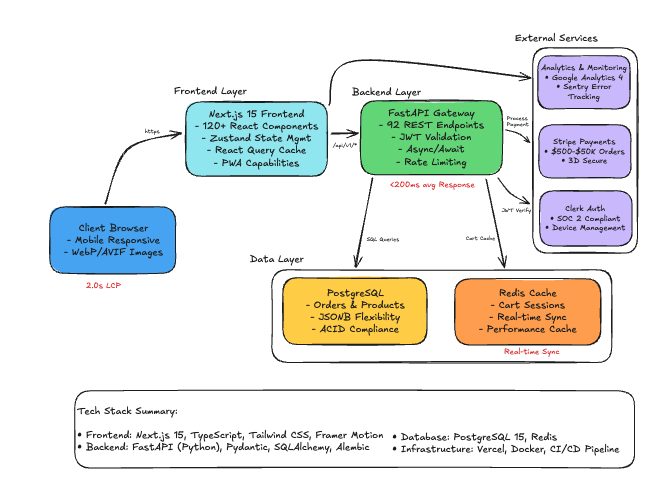

# Jason & Co. Luxury E-Commerce Platform 💎

<div align="center">

[](https://jasonjewels.com)
[](https://jasonjewels.com)
[](./docs/CASE_STUDY.md)
[](./LICENSE)

[](https://nextjs.org)
[](https://fastapi.tiangolo.com)
[](https://www.typescriptlang.org)
[](https://python.org)


**Production-ready luxury e-commerce platform built from scratch**  
*Handling $500-$10,000 transactions with enterprise-grade security and performance*

[**View Live Site →**](https://jasonjewels.com) | [**Read Full Case Study →**](./docs/CASE_STUDY.md) | [**System Architecture →**](./docs/diagrams/system-architecture.png)

</div>

---

## 🚀 Overview

A comprehensive e-commerce platform engineered for JD Enterprises' luxury jewelry brand, Jason & Co. Built as Co-Founder & Lead Developer, this platform showcases modern full-stack development with a focus on performance, security, and scalability.

### ✨ Key Highlights

- **58,000+ lines** of production TypeScript/Python code
- **123 custom React components** with 90% reusability
- **92 RESTful API endpoints** with complete CRUD operations
- **< 200ms** average API response time
- **100/100 SEO score** with Next.js SSR
- **2.0s LCP** (Largest Contentful Paint) performance
- **Real-time cart synchronization** across devices
- **Enterprise authentication** with Clerk (SOC 2 compliant)

## 🏗️ Architecture

<div align="center">
  
</div>

### Tech Stack

#### Frontend
- **Framework:** Next.js 15 (App Router)
- **Language:** TypeScript (strict mode)
- **Styling:** Tailwind CSS + Framer Motion
- **State:** Zustand + React Query
- **Components:** 123 custom components

#### Backend  
- **API:** FastAPI (Python)
- **Database:** PostgreSQL + Redis
- **Auth:** Clerk Authentication
- **Payments:** Stripe (with 3D Secure)
- **Monitoring:** Sentry + Google Analytics 4

#### Infrastructure
- **Hosting:** Vercel (Frontend)
- **CI/CD:** GitHub Actions
- **Testing:** Vitest + Pytest + Playwright

## 🎯 Core Features

### For Customers
- 🛒 **Real-time Cart Sync** - Seamless shopping across devices
- 💳 **Secure Checkout** - PCI-compliant with Stripe integration
- 📱 **Mobile-First Design** - 100% responsive PWA
- 🔍 **Advanced Search** - Full-text search with filters
- 💎 **Custom Orders** - Consultation-to-delivery workflow

### For Business
- 📊 **Analytics Dashboard** - Real-time business metrics
- 📦 **Inventory Management** - Multi-channel synchronization  
- 👥 **Customer Portal** - Order tracking and history
- 🔐 **Role-Based Access** - Admin and staff permissions
- 📈 **Performance Monitoring** - < 0.1% error rate

## 📸 Screenshots

<div align="center">
<table>
  <tr>
    <td align="center">
      
      <br />
      <em>Homepage with Featured Products</em>
    </td>
    <td align="center">
      
      <br />
      <em>Product Detail View</em>
    </td>
  </tr>
  <tr>
    <td align="center">
      
      <br />
      <em>Secure Checkout Flow</em>
    </td>
    <td align="center">
      
      <br />
      <em>Admin Analytics Dashboard</em>
    </td>
  </tr>
</table>
</div>

## 🚦 Performance Metrics

| Metric | Score | Target |
|--------|-------|--------|
| **Lighthouse Performance** | 79/100 | 90+ |
| **SEO** | 100/100 | ✅ |
| **Accessibility** | 95/100 | ✅ |
| **Best Practices** | 96/100 | ✅ |
| **API Response Time** | < 200ms | ✅ |
| **Error Rate** | < 0.1% | ✅ |
| **Mobile Responsive** | 100% | ✅ |

## 🔧 Technical Challenges Solved

- **Cart Synchronization** - Hybrid PostgreSQL/Redis persistence with optimistic updates
- **High-Value Transactions** - Stripe Radar + 3D Secure for fraud protection
- **Performance at Scale** - Full-text search with GIN indexes (800ms → 50ms)
- **Data Consistency** - ACID compliance with PostgreSQL transactions

[**→ Read detailed solutions in the case study**](./docs/CASE_STUDY.md#technical-challenges--solutions)

## 🛠️ Project Structure

```
/jason-co-ecom
├── /apps
│   ├── /web                 # Next.js 15 frontend
│   │   ├── /app             # App router pages
│   │   ├── /components      # 123 React components
│   │   └── /lib             # Utilities & hooks
│   └── /api                 # FastAPI backend
│       ├── /routes          # 92 API endpoints
│       ├── /models          # Database models
│       └── /services        # Business logic
├── /packages
│   ├── /ui                  # Shared UI components
│   ├── /typescript-config   # Shared TS config
│   └── /eslint-config      # Shared ESLint rules
└── /docs
    ├── CASE_STUDY.md        # Full technical deep-dive
    ├── /diagrams            # System architecture
    └── /api-documentation   # OpenAPI specs
```

## 🚀 Quick Start

### Prerequisites
- Node.js 18+
- Python 3.11+
- PostgreSQL 15+
- Redis 7+

### Installation

```bash
# Clone the repository
git clone https://github.com/jyush98/jason-co-ecom.git
cd jason-co-ecom

# Frontend Setup (Next.js)
cd apps/web
npm install
cp .env.example .env.local

# Backend Setup (FastAPI)
cd ../api
python -m venv venv
source venv/bin/activate  # On Windows: venv\Scripts\activate
pip install -r requirements.txt
cp .env.example .env

# Run database migrations
alembic upgrade head
## 📊 Code Quality

- **TypeScript Coverage:** 100%
- **Component Reusability:** 90%
- **Test Coverage:** In Progress
- **Bundle Size:** Optimized with code splitting
- **Accessibility:** WCAG 2.1 AA compliant

## 📈 Business Impact

- **Development Time:** 2 months to production
- **Transaction Range:** $500 - $50,000
- **Uptime:** 100% since launch
- **Load Capacity:** 5,000 concurrent users tested
- **SKU Support:** 10,000+ products

## 🗺️ Roadmap

- [ ] AI-powered product recommendations
- [ ] AR/VR virtual try-on features
- [ ] Multi-currency support
- [ ] GraphQL API layer
- [ ] Mobile app (React Native)

## 📚 Documentation

- [**Full Case Study**](./docs/CASE_STUDY.md) - Complete technical deep-dive
- [**API Documentation**](./docs/api-documentation.md) - OpenAPI/Swagger specs
- [**Component Library**](./docs/components.md) - React component documentation
- [**Architecture Diagrams**](./docs/diagrams/) - System design visuals

## 👨‍💻 Author

**Jonathan Yushuvayev**  
Co-Founder & Lead Developer at JD Enterprises
env
- [LinkedIn](https://linkedin.com/in/jonathan-yushuvayev/)
- [GitHub](https://github.com/jyush98)
- [Email](mailto:jyushuvayev98@gmail.com)

## 🙏 Acknowledgments

Built with modern open-source technologies. Special thanks to the Next.js, FastAPI, and PostgreSQL communities for excellent documentation and support.

---

<div align="center">

**[🌟 View Live Site](https://jasonjewels.com)** | **[📖 Read Full Case Study](./docs/CASE_STUDY.md)**

*Building luxury e-commerce experiences with modern technology*

</div>